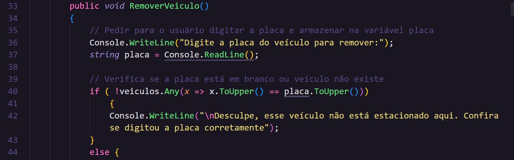

### Base do projeto:

[Código do Buta](https://github.com/digitalinnovationone/trilha-net-fundamentos-desafio/blob/main/DesafioFundamentos/Models/Estacionamento.cs)

### Refatorações

* Renomeando variáveis para nomes significativos

* Fail Fast - tratando o erro primeiro

### Acréscimos

* Função que verifica se a placa digitada é nula ou está em branco

* while com condição de parada a placa no formato estar correto

