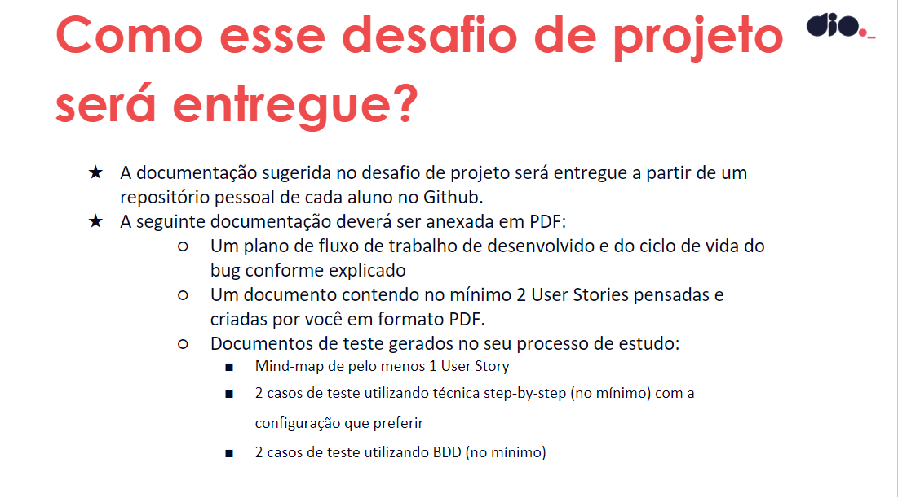
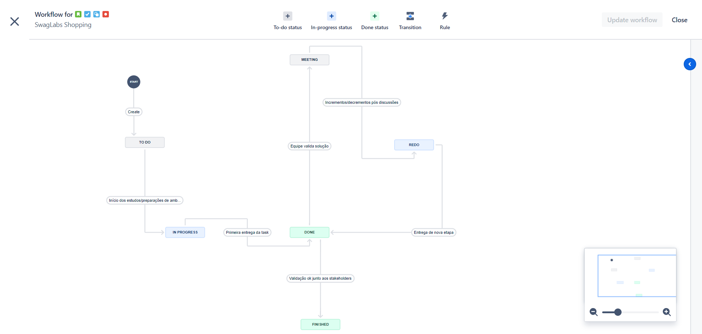
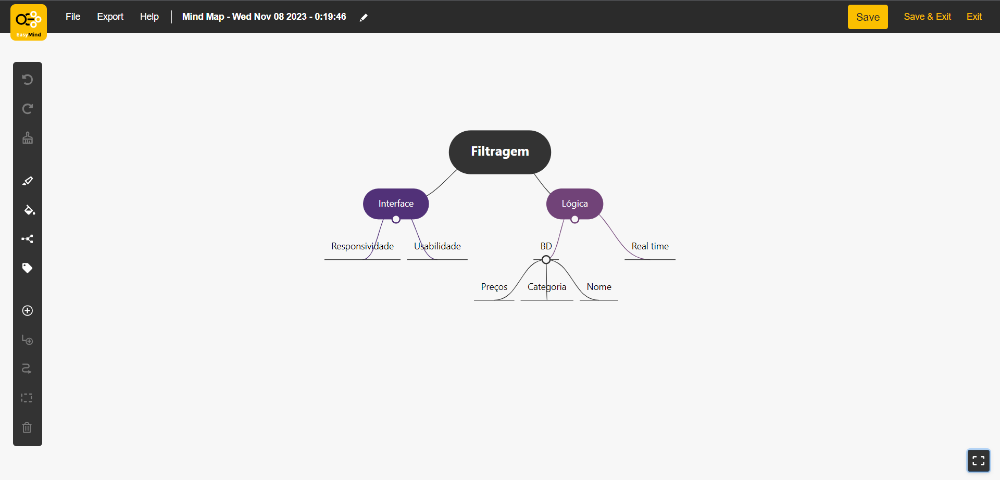

### 1. Plano de fluxo de trabalho

### 2. Users Stories
[User storie 1](SWDIO-1.pdf)
[User storie 2](SWDIO-2.pdf)

### 3. Mindmap - História 1

### 4. Casos de teste step-by-step

### 5. Casos de teste BDD
