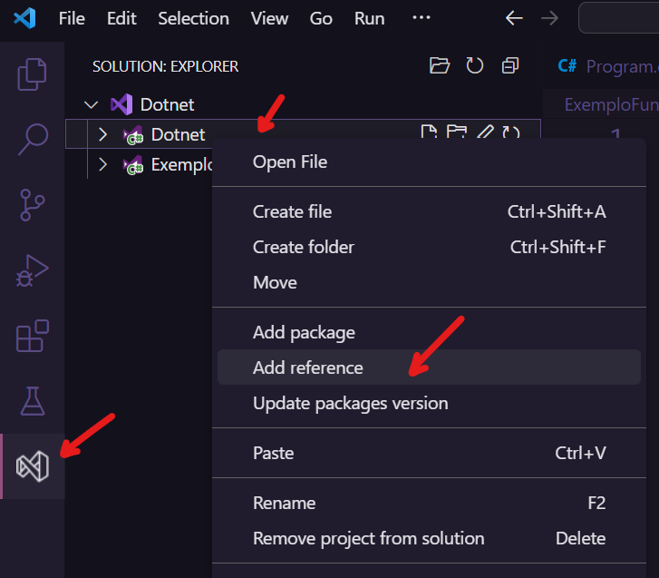

### Extensões

vscode-solution-explorer - para ver os sln (gerenciador de soluções) de forma mais intuitiva. Você pode ter vários projetos conversando e favorecer reutilização de código. De forma leiga, permite "imports" (termo do js)

### Como criar projeto com versão 5.0

Tendo a versão alvo instalada, crie uma pasta vazia, entre nela com 'cd' e no terminal, digite 
```
dotnet new console --framework net5.0
```

### Adicionar dependências

1. Guia 'Solution'
2. Clique no projeto listado (pasta que abrange todos os projetos)
3. Clique, com botão direito, no projeto alvo (subpasta que utilizará a .Common)
4. Selecione `add reference`


